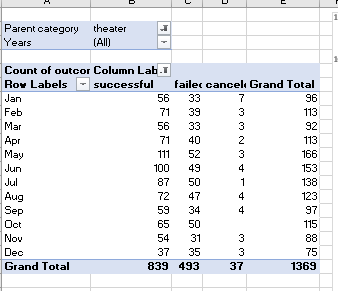
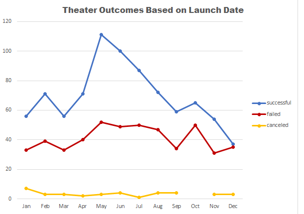
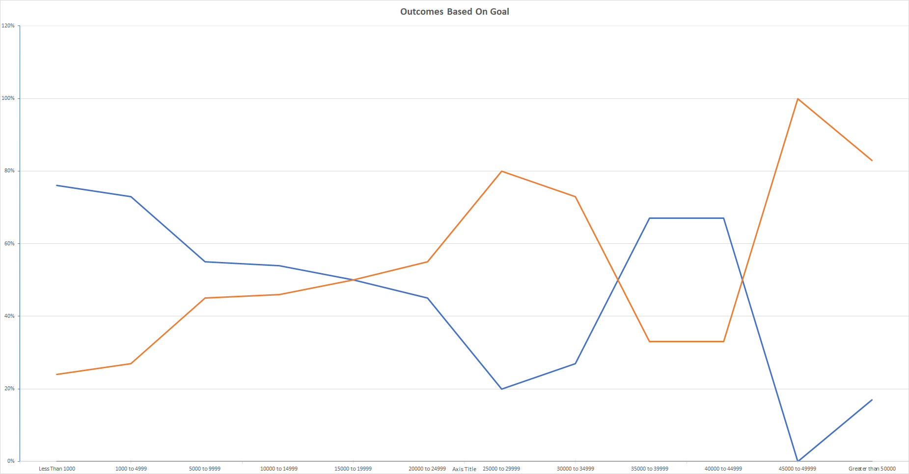

# Kickstarting with Excel
## Overview of the project:
A playwriter named Louise wants to start a crowdfunding campaign to fund her play “FEVER” with an estimated budget of $10,000. Louise also wants to analyze how different 
campaigns fared in relation to their launch dates and funding goals.
### Purpose
The purpose of this project is to use Excel sheet as a tool to understand the parameters required to make her campaign successful.
## Analysis and Challenges
Analysis was based on two parameters viz: outcomes based on goals and outcomes based on launch date. This is done with theater as a category, because it was proved earlier that theater outcome was successful compared to Food, Games, Technology etc. 
### Analysis based on Launch date:
To analyze the outcome based on launch date, a formula was used to create a column named “Date Ended Conversion” to convert the timestamp into a day-month-year format for interpretation in the Kickstarter data workbook. Then year was extracted from the “Date Created Conversion “column using a function called Year () to create a new column for Year. Based on these data, a pivot table was created into a new sheet named as “Theater Outcomes by Launch Date” from Kickstarter worksheet. By creating filters for “Parent Category” and “Years”, then filter the column labels for “successful”, “failed “and “canceled “and sorted in descending order so successful is first, and a pivot chart and a line graph was created as below and saved as Theater_Outcomes_vs_Launch.png

[Kickstarter_Challenge.xlsx](Kickstarter_Challenge.xlsx)

### Analysis based on Goal’s outcome:
After creating outcome analyses based on launch date, I performed another analyses to visualize the percentage of successful, failed, and canceled plays based on funding goal amount. For that, I created columns to populate the data for “Number Successful”, “Number Failed," and "Number Canceled" using COUNTIFS () function, which collects the outcome and goal data based on “plays” subcategory. Also, I created a “Goal” column to create dollar-amount ranges so that projects can be grouped based on their goal amount. Another function named Sum () is used to populate the “Total Projects” column to add the total of Number of successful, failed, and canceled data. Percentage of Successful, failed, and canceled data were calculated based on data from the “Total Projects “column using the formula. A line chart was created and saved as Outcomes_vs_Goals.png with goal ranges on X-axis and percentage of successful, failed and canceled on Y-axis.

.

### Challenges:
I found a big challenge in interpreting the data, because there could be multiple ways or parameters to determine a successful campaign. But I started with two parameters at a time, example outcome and goal, then started to think about is the outcome successful is based on goal amount or the number of people contributed, then choose the country parameter and so on. Also, I faced another challenge while creating a graph with the calculated data, I couldn’t figure out why my graph does not look exactly like the reference; it took some time for to debug it and figured it out that a typo in formula caused my graph to go wrong.
## Results:
### Conclusions about the Theater Outcomes by Launch Date
•	The month of May has the highest Launch Outcome Success followed by June and July.

•	The month of December has the lowest Launch Outcome Success.

### Conclusions about the Outcomes based on Goals
•	When Louise set the goal amount to less than $1000, the percentage of success rate was higher. But as the amount goes higher the percentage of success started decreasing. 
 
### Limitation of the data set 
•	More parameters need to be included along with launch date and goal amount like data of audience signed up before the launch date, etc. to analyze and make this project 
  successful.
  ### 	What are some other possible tables and/or graphs that we could create?
•	It is better to include the  graphs of successful outcomes based on Parent Category and Subcategory in US.

•	If we can include statistical analysis tables with mean and median values,then Louise will be able to easily determine and extreme data points and take appropiate steps tomake her campaign successful. 

